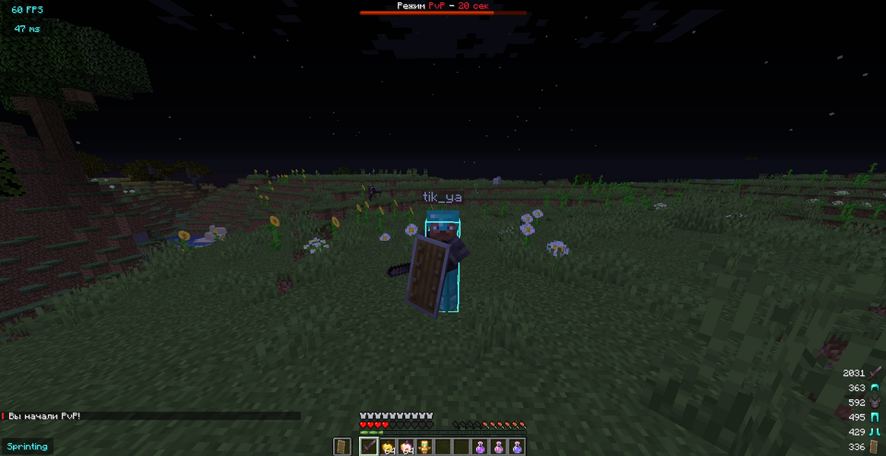
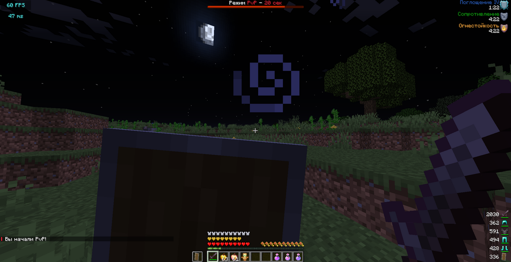

## 🛡️ BloodMineAntiRelog
The plugin adds a battle mode to your server. During which if a player leaves the server all his resources are on the ground. This plugin solves the problem of PvP and makes it fair

### Usage
`Add the .jar file to the plugins folder and start your server.`

### Dependencies
- Paper 1.16.5+

### Supported plugins (Optional)​
- WorldGuard
- CMI

### Commands
- /ar help - List of commands
- /ar reload - Reloads the configuration
- /ar test {player} - Gives the player a battle mode
### Permissions
- antirelog.bypass - Player will not be given PvP mode
- antirelog.help- Access to /ar help command
- antirelog.reload- Access the command /ar reload
- antirelog.test- Access the command /ar test {player}

### Screenshots
- 
- 

##### :ghost: [by TheDiVaZo](https://github.com/BloodMineCloud/BloodMineAntiRelog "by Katze")
